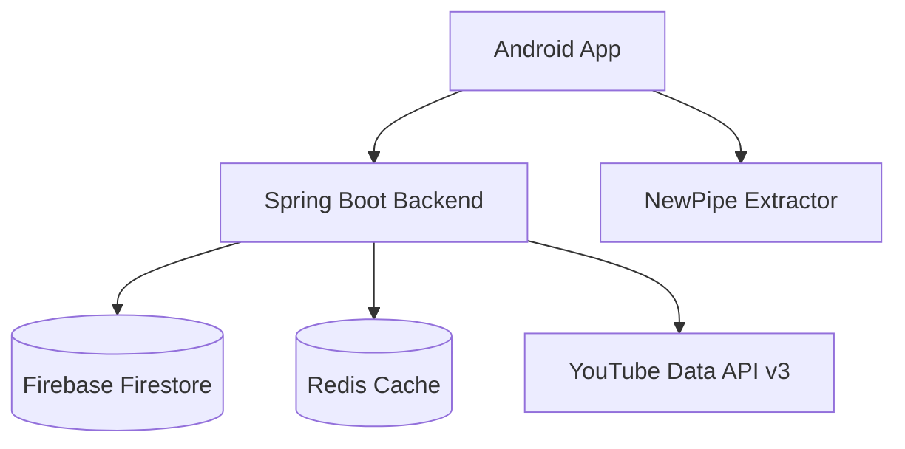

# Main Branch Work - Safe Tasks During Parallel Development

**Updated**: 2025-10-05
**Context**: While 3 engineers work on feature branches, these tasks can proceed safely on `main`

---

## ✅ Safe to Work On (Won't Conflict)

### 🎯 Priority 1: CI/CD & DevOps (Week 1)

**Why Safe**: Infrastructure files are rarely touched by feature development

#### **INFRA-01: Android CI/CD Pipeline**
**Ticket Code**: `INFRA-01`
**Branch**: Work directly on `main` OR `feature/infra-cicd`

**Tasks**:
1. Create `.github/workflows/android-ci.yml`
   - Build on every push to main and PRs
   - Run unit tests (`./gradlew test`)
   - Run lint checks (`./gradlew lint`)
   - Upload APK artifacts
   - Check code coverage

2. Add status badges to `README.md`
   - Build status
   - Test coverage
   - Latest release

**Files to Create**:
- `.github/workflows/android-ci.yml`
- `.github/workflows/frontend-ci.yml`

**Commit Template**:
```
INFRA-01: Add Android and Frontend CI pipelines

- Android CI: build, test, lint on every push
- Frontend CI: npm test, build, deploy preview
- Status badges in README.md
- Artifact upload for APKs

🤖 Generated with [Claude Code](https://claude.com/claude-code)

Co-Authored-By: Claude <noreply@anthropic.com>
```

---

#### **INFRA-02: Docker Setup for Local Development**
**Ticket Code**: `INFRA-02`

**Tasks**:
1. Create `docker-compose.yml`
   - Backend service (Spring Boot)
   - Frontend service (npm dev server)
   - Firebase emulator
   - Redis (if needed)

2. Create `Dockerfile` for each service
3. Document in `docs/PLATFORM_GUIDES.md`

**Why Safe**: Docker files don't conflict with code

---

### 🎯 Priority 2: Testing Infrastructure (Week 2)

**Why Safe**: Test utilities and base classes are separate from feature code

#### **TEST-01: Android Test Utilities**
**Ticket Code**: `TEST-01`

**Tasks**:
1. Create test utilities in `android/app/src/test/java/com/albunyaan/tube/testutil/`
   - `TestCoroutineRule.kt` - Coroutine testing helper
   - `MockRepositoryFactory.kt` - Mock repository creator
   - `TestDataFactory.kt` - Test data generators

2. Create instrumentation test base classes
   - `BaseInstrumentationTest.kt`
   - `BaseFragmentTest.kt`

**Files to Create** (Won't conflict with parallel work):
```
android/app/src/test/java/com/albunyaan/tube/testutil/
  ├── TestCoroutineRule.kt
  ├── MockRepositoryFactory.kt
  ├── TestDataFactory.kt
  └── ViewModelTestExtensions.kt

android/app/src/androidTest/java/com/albunyaan/tube/testutil/
  ├── BaseInstrumentationTest.kt
  └── BaseFragmentTest.kt
```

**Why Safe**: These are utility classes that don't touch feature code

---

#### **TEST-02: Backend Integration Test Suite**
**Ticket Code**: `TEST-02`

**Tasks**:
1. Create base test class: `BaseIntegrationTest.java`
2. Firebase emulator test setup
3. Test data seeders
4. API contract tests (OpenAPI validation)

**Files to Create**:
```
backend/src/test/java/com/albunyaan/tube/integration/
  ├── BaseIntegrationTest.java
  ├── FirebaseTestConfig.java
  └── TestDataSeeder.java
```

**Why Safe**: Backend engineer is working on controllers/services, not test infrastructure

---

### 🎯 Priority 3: Documentation (Ongoing)

**Why Safe**: Docs rarely conflict, easy to merge

#### **DOCS-01: API Documentation**
**Ticket Code**: `DOCS-01`

**Tasks**:
1. Complete `docs/api/openapi-draft.yaml`
   - Document all existing endpoints
   - Add request/response examples
   - Add authentication details

2. Setup Swagger UI
   - Integrate in backend
   - Host at `/api-docs`

3. Create Postman collection
   - Export from OpenAPI spec
   - Save to `docs/api/postman-collection.json`

**Files to Create/Modify**:
- `docs/api/openapi-draft.yaml` (expand existing)
- `docs/api/postman-collection.json`
- `backend/pom.xml` (add Swagger dependency)

**Why Safe**: Documentation files are rarely touched by feature developers

---

#### **DOCS-02: Architecture Diagrams**
**Ticket Code**: `DOCS-02`

**Tasks**:
1. Create architecture diagrams with Mermaid.js
   - System architecture diagram
   - Data flow diagrams
   - Player state machine
   - Download flow diagram

2. Add to `docs/architecture/diagrams/`

**Files to Create**:
```
docs/architecture/diagrams/
  ├── system-architecture.md (Mermaid diagram)
  ├── data-flow.md
  ├── player-state-machine.md
  └── download-flow.md
```

**Example Mermaid Diagram**:


**Why Safe**: Diagrams don't conflict with code

---

### 🎯 Priority 4: Code Quality Tools (Week 3)

#### **QUALITY-01: Code Formatting & Linting**
**Ticket Code**: `QUALITY-01`

**Tasks**:
1. Setup Kotlin formatting
   - Add `ktlint` to Android project
   - Create `.editorconfig`
   - Add pre-commit hook

2. Setup ESLint for Frontend
   - Extend existing config
   - Add auto-fix on commit

3. Setup Java formatting for Backend
   - Add `google-java-format` plugin
   - Configure in `pom.xml`

**Files to Create**:
```
.editorconfig
.husky/pre-commit (Git hooks)
android/app/.ktlint
frontend/.eslintrc.js (update)
backend/pom.xml (add formatter plugin)
```

**Why Safe**: Formatter configs don't conflict with feature code

---

#### **QUALITY-02: Static Analysis**
**Ticket Code**: `QUALITY-02`

**Tasks**:
1. Add Android lint configuration
   - Custom lint rules
   - Baseline file to ignore existing issues

2. Add SonarQube integration
   - Setup SonarCloud project
   - Add to CI pipeline

**Why Safe**: Analysis tools are infrastructure

---

### 🎯 Priority 5: Developer Experience (Ongoing)

#### **DX-01: Developer Setup Script**
**Ticket Code**: `DX-01`

**Tasks**:
1. Create `scripts/setup.sh`
   ```bash
   #!/bin/bash
   # Setup development environment
   # - Check prerequisites (Java, Node, Android SDK)
   # - Install dependencies
   # - Setup Firebase emulator
   # - Create local.properties
   ```

2. Create `scripts/start-dev.sh`
   ```bash
   #!/bin/bash
   # Start all services for development
   # - Firebase emulator
   # - Backend server
   # - Frontend dev server
   ```

**Files to Create**:
```
scripts/
  ├── setup.sh
  ├── start-dev.sh
  ├── run-tests.sh
  └── clean.sh
```

**Why Safe**: Scripts don't touch feature code

---

#### **DX-02: VS Code Workspace Configuration**
**Ticket Code**: `DX-02`

**Tasks**:
1. Create `.vscode/settings.json`
   - Recommended extensions
   - Formatter settings
   - Debug configurations

2. Create `.vscode/launch.json`
   - Backend debug config
   - Frontend debug config
   - Android debug config

**Why Safe**: IDE configs are gitignored or team-specific

---

### 🎯 Priority 6: Localization Infrastructure (Week 4)

#### **I18N-01: Localization Setup**
**Ticket Code**: `I18N-01`

**Tasks**:
1. **Android**: Add Arabic and Dutch strings
   - Create `values-ar/strings.xml`
   - Create `values-nl/strings.xml`
   - Copy existing English strings
   - Mark as "TODO: Translate"

2. **Frontend**: Setup i18n framework
   - Add vue-i18n or react-i18n
   - Create `frontend/src/locales/ar.json`
   - Create `frontend/src/locales/nl.json`

3. **Backend**: Add locale support
   - Configure MessageSource
   - Create `messages_ar.properties`
   - Create `messages_nl.properties`

**Files to Create**:
```
android/app/src/main/res/
  ├── values-ar/strings.xml
  └── values-nl/strings.xml

frontend/src/locales/
  ├── en.json
  ├── ar.json
  └── nl.json

backend/src/main/resources/i18n/
  ├── messages_en.properties
  ├── messages_ar.properties
  └── messages_nl.properties
```

**Why Safe**: New locale files don't conflict with feature development

---

## 🚫 Avoid These (Will Conflict)

### ❌ **Don't Touch While Parallel Work Active**:

1. **Backend Controllers/Services**
   - ❌ `backend/src/main/java/com/albunyaan/tube/controller/`
   - ❌ `backend/src/main/java/com/albunyaan/tube/service/`
   - **Why**: Backend engineer is actively working here

2. **Frontend Components**
   - ❌ `frontend/src/components/admin/`
   - ❌ `frontend/src/views/`
   - **Why**: Frontend engineer is building admin UI

3. **Android UI Code**
   - ❌ `android/app/src/main/java/com/albunyaan/tube/ui/downloads/`
   - ❌ `android/app/src/main/res/layout/` (new download layouts)
   - **Why**: Android engineer is building downloads UI

4. **Shared Models** (Be Careful)
   - ⚠️ `backend/src/main/java/com/albunyaan/tube/model/`
   - ⚠️ `android/app/src/main/java/com/albunyaan/tube/data/model/`
   - **Why**: Adding new fields might conflict

---

## 📋 Recommended Work Schedule

### **Week 1: Infrastructure**
- ✅ INFRA-01: Android & Frontend CI pipelines
- ✅ INFRA-02: Docker setup
- ✅ DX-01: Developer setup scripts

**Commits**: 3-4 commits, push to main daily

---

### **Week 2: Testing**
- ✅ TEST-01: Android test utilities
- ✅ TEST-02: Backend integration tests
- ✅ QUALITY-01: Code formatting setup

**Commits**: 3-4 commits, push to main daily

---

### **Week 3: Documentation & Quality**
- ✅ DOCS-01: API documentation (OpenAPI)
- ✅ DOCS-02: Architecture diagrams
- ✅ QUALITY-02: Static analysis tools

**Commits**: 3-4 commits, push to main daily

---

### **Week 4: DX & i18n**
- ✅ I18N-01: Localization infrastructure
- ✅ DX-02: VS Code workspace config
- ✅ Final polish before merge

**Commits**: 2-3 commits, push to main

---

## 🔄 Coordination with Parallel Work

### **Daily Sync (5 minutes)**

Post in team chat:
> "💼 Main Branch: Today working on INFRA-01 (Android CI). Won't touch any feature code. Safe to proceed."

### **Before Pushing to Main**

1. Check team chat: "Anyone about to push to main?"
2. Wait for "all clear"
3. Pull latest: `git pull origin main`
4. Push your work: `git push origin main`
5. Announce: "💼 Pushed INFRA-01 to main. CI pipeline added."

### **If Conflict Occurs**

Very unlikely, but if it happens:
1. Announce immediately
2. Coordinate with affected engineer
3. Resolve together on video call

---

## ✅ Success Metrics

By end of 3 weeks:

- ✅ **CI/CD**: All platforms have automated testing
- ✅ **Testing**: Test coverage increased by 20%
- ✅ **Documentation**: Complete API docs and diagrams
- ✅ **Code Quality**: Linters and formatters in place
- ✅ **Developer Experience**: 5-minute setup for new developers
- ✅ **Localization**: Infrastructure ready for 3 languages

**Total Commits**: ~12-15 commits over 3 weeks

**Zero Conflicts**: Infrastructure work is isolated from feature work

---

## 📊 Progress Tracking

Update `docs/PROJECT_STATUS.md`:

```markdown
## Main Branch Work (Infrastructure & DevOps)

**Engineer**: DevOps/QA Team
**Timeline**: 2025-10-05 to 2025-10-26

### Week 1: Infrastructure ✅
- ✅ INFRA-01: CI/CD pipelines (2025-10-05)
- ✅ INFRA-02: Docker setup (2025-10-08)
- ✅ DX-01: Dev setup scripts (2025-10-10)

### Week 2: Testing ⏳
- ⏳ TEST-01: Test utilities (In Progress)
- ⏸️ TEST-02: Integration tests (Not Started)

### Week 3: Documentation ⏸️
- ⏸️ DOCS-01: API documentation
- ⏸️ DOCS-02: Architecture diagrams

### Week 4: Polish ⏸️
- ⏸️ I18N-01: Localization setup
- ⏸️ DX-02: VS Code config
```

---

## 🎯 Quick Start

**Choose your first task**:

```bash
# Week 1: Start with CI/CD
cat docs/MAIN_BRANCH_WORK.md | grep -A 20 "INFRA-01"

# Create the workflow file
touch .github/workflows/android-ci.yml
# (Follow template in prompt)

# Commit and push
git add .github/workflows/android-ci.yml
git commit -m "INFRA-01: Add Android CI pipeline"
git push origin main
```

---

## 🤝 Communication Template

**Starting a task**:
> "💼 Main Branch: Starting INFRA-01 (Android CI). Working on .github/workflows/. ETA: 1 day."

**Completing a task**:
> "💼 Main Branch: ✅ INFRA-01 complete. Android CI pipeline live. All builds passing."

**Daily update**:
> "💼 Main: Working on TEST-01 today. Creating test utilities. No conflicts expected."

---

**These tasks keep the project moving forward while avoiding any conflicts with parallel feature development!** 🚀
