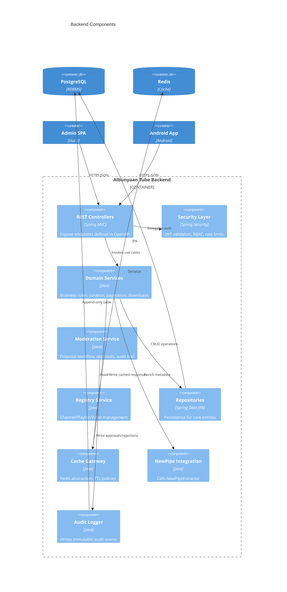

# C4 Level 3 — Backend Component Diagram

```mermaid
C4Component
    title Backend Components
    Container_Boundary(backend, "Albunyaan Tube Backend") {
        Component(api, "REST Controllers", "Spring MVC", "Expose endpoints defined in OpenAPI")
        Component(security, "Security Layer", "Spring Security", "JWT validation, RBAC, rate limits")
        Component(service, "Domain Services", "Java", "Business rules: curation, pagination, downloads")
        Component(moderation, "Moderation Service", "Java", "Proposal workflow, approvals, audit trail")
        Component(registry, "Registry Service", "Java", "Channel/Playlist/Video management")
        Component(repo, "Repositories", "Spring Data JPA", "Persistence for core entities")
        Component(cache, "Cache Gateway", "Java", "Redis abstraction, TTL policies")
        Component(integration, "NewPipe Integration", "Java", "Calls NewPipeExtractor")
        Component(audit, "Audit Logger", "Java", "Writes immutable audit events")
    }

    ContainerDb(postgres, "PostgreSQL", "RDBMS")
    ContainerDb(redis, "Redis", "Cache")
    Container(adminSpa, "Admin SPA", "Vue 3")
    Container(android, "Android App", "Android")

    Rel(adminSpa, api, "HTTPS JSON")
    Rel(android, api, "HTTPS JSON")
    Rel(api, security, "Delegates auth")
    Rel(api, service, "Invokes use cases")
    Rel(service, repo, "CRUD operations")
    Rel(service, cache, "Read/Write cached responses")
    Rel(cache, redis, "Serialize")
    Rel(repo, postgres, "JPA")
    Rel(service, integration, "Enrich metadata")
    Rel(moderation, audit, "Write approvals/rejections")
    Rel(audit, postgres, "Append-only table")
```
