# C4 Level 3 — Backend Component Diagram

```mermaid
C4Component
    title Backend Components (Spring Boot + Firebase)
    Container_Boundary(backend, "Albunyaan Tube Backend") {
        Component(controllers, "REST Controllers", "Spring MVC", "14 controllers: Public, Admin, Player, YouTube, Approval, etc.")
        Component(security, "Security Layer", "Spring Security + Firebase Auth", "JWT token validation, RBAC (ADMIN/MODERATOR), custom claims")

        ComponentQueue(services, "Domain Services", "Java", "Business logic layer")
        Component(publicService, "PublicContentService", "Java", "Mobile app content API")
        Component(approvalService, "ApprovalService", "Java", "Approval workflow, pending queue")
        Component(youtubeService, "YouTubeService", "Java", "YouTube search integration")
        Component(videoValidation, "VideoValidationService", "Java", "Detect unavailable videos")
        Component(importExport, "Import/ExportService", "Java", "Bulk operations (dual formats)")
        Component(downloadService, "DownloadService", "Java", "Download tokens, policy enforcement")
        Component(playerService, "PlayerService", "Java", "UpNext recommendations")
        Component(auditService, "AuditLogService", "Java", "Immutable audit trail")
        Component(authService, "AuthService", "Java", "Firebase Auth wrapper")

        ComponentQueue(repositories, "Firestore Repositories", "Java", "Data access layer")
        Component(channelRepo, "ChannelRepository", "Java", "Channels CRUD")
        Component(playlistRepo, "PlaylistRepository", "Java", "Playlists CRUD")
        Component(videoRepo, "VideoRepository", "Java", "Videos CRUD")
        Component(categoryRepo, "CategoryRepository", "Java", "Categories CRUD")
        Component(userRepo, "UserRepository", "Java", "Users CRUD")
        Component(auditRepo, "AuditLogRepository", "Java", "Audit logs CRUD")
        Component(validationRepo, "ValidationRunRepository", "Java", "Validation runs CRUD")

        Component(cache, "Cache Manager", "Spring Cache", "Caffeine (dev) / Redis (prod)")
        Component(newpipe, "NewPipe Integration", "Java", "NewPipeExtractor for stream URLs")
    }

    ContainerDb(firestore, "Cloud Firestore", "NoSQL Document DB", "7 collections: channels, playlists, videos, categories, users, audit_logs, validation_runs")
    ContainerDb(firebaseAuth, "Firebase Authentication", "Auth Service", "User management, custom claims")
    ContainerDb(redis, "Redis", "Cache Store", "Production caching (5-min TTL)")
    Container(adminSpa, "Admin Dashboard", "Vue 3 + TypeScript", "Web-based moderation interface")
    Container(android, "Android App", "Kotlin + Jetpack", "Mobile client")

    Rel(adminSpa, controllers, "HTTPS/JSON", "Admin API calls")
    Rel(android, controllers, "HTTPS/JSON", "Public API calls")

    Rel(controllers, security, "Authenticates", "JWT token validation")
    Rel(security, firebaseAuth, "Validates tokens", "Firebase Admin SDK")

    Rel(controllers, services, "Invokes", "Business logic")

    Rel(publicService, repositories, "Queries", "Read approved content")
    Rel(approvalService, repositories, "Queries/Updates", "Approval workflow")
    Rel(youtubeService, cache, "Reads/Writes", "Search results caching")
    Rel(videoValidation, repositories, "Queries/Updates", "Video availability checks")
    Rel(importExport, repositories, "Bulk operations", "Import/export")
    Rel(downloadService, repositories, "Queries", "Download metadata")
    Rel(playerService, repositories, "Queries", "Recommendations")
    Rel(auditService, auditRepo, "Writes", "Append-only audit trail")
    Rel(authService, firebaseAuth, "Manages", "User operations")

    Rel(repositories, firestore, "CRUD", "Firestore SDK")
    Rel(cache, redis, "Serializes", "Prod: Redis, Dev: Caffeine in-memory")

    Rel(approvalService, auditService, "Logs actions", "Audit trail")
    Rel(controllers, newpipe, "Extracts streams", "Video playback URLs")

    UpdateLayoutConfig($c4ShapeInRow="4", $c4BoundaryInRow="1")
```

## Key Architecture Decisions

### Database: Firebase Firestore (NoSQL)
- **Replaced PostgreSQL** with Cloud Firestore for:
  - Serverless scaling
  - Real-time updates
  - Native Firebase Auth integration
  - Simplified deployment (no DB server management)
- **Collections**: 7 main collections (channels, playlists, videos, categories, users, audit_logs, validation_runs)
- **No JPA/Hibernate**: Direct Firestore SDK usage in repositories

### Controllers (14 Total)
1. **PublicContentController** - Public API for mobile app
2. **ApprovalController** - Approval workflow (admin)
3. **CategoryController** - Category management (admin)
4. **ChannelController** - Channel operations (admin)
5. **ContentLibraryController** - Content library management (admin)
6. **RegistryController** - Internal workflow API (add to pending queue)
7. **YouTubeSearchController** - YouTube search integration (admin)
8. **VideoValidationController** - Video validation triggers (admin)
9. **ImportExportController** - Bulk import/export (admin)
10. **DashboardController** - Metrics & analytics (admin)
11. **AuditLogController** - Audit trail queries (admin)
12. **UserController** - User management (admin)
13. **DownloadController** - Download management (mobile)
14. **PlayerController** - Player recommendations (mobile)

### Services (13 Total)
- **PublicContentService**: Mobile app content queries
- **ApprovalService**: Approval workflow logic
- **YouTubeService**: YouTube Data API v3 integration with caching
- **VideoValidationService**: Detect deleted/unavailable YouTube videos
- **ImportExportService**: Full format import/export
- **SimpleImportService**: Simple CSV-like import
- **SimpleExportService**: Simple format export
- **DownloadService**: Download policy enforcement
- **DownloadTokenService**: Token generation for secure downloads
- **PlayerService**: UpNext recommendations algorithm
- **AuditLogService**: Immutable audit trail
- **AuthService**: Firebase Auth wrapper
- **CategoryMappingService**: Category hierarchy utilities

### Repositories (7 Total)
All use Firestore SDK directly (no Spring Data JPA):
- **ChannelRepository**: Firestore `channels` collection
- **PlaylistRepository**: Firestore `playlists` collection
- **VideoRepository**: Firestore `videos` collection
- **CategoryRepository**: Firestore `categories` collection
- **UserRepository**: Firestore `users` collection
- **AuditLogRepository**: Firestore `audit_logs` collection
- **ValidationRunRepository**: Firestore `validation_runs` collection

### Caching Strategy (BACKEND-PERF-01)
- **Development**: Caffeine (in-memory cache)
- **Production**: Redis (distributed cache)
- **TTL**: 5 minutes for most endpoints
- **Cache keys**: YouTube search results (channels, playlists, videos)
- **Configuration**: Spring Cache abstraction for easy switching

### Security (Firebase Authentication)
- **JWT Validation**: Firebase Admin SDK validates tokens
- **Custom Claims**: ADMIN and MODERATOR roles stored in Firebase custom claims
- **RBAC**: Spring Security `@PreAuthorize` annotations check roles
- **No password storage**: Firebase handles authentication

### External Integrations
- **NewPipeExtractor**: Extract video stream URLs without official YouTube API
- **YouTube Data API v3**: Search channels/playlists/videos (with caching)
- **Firebase Admin SDK**: Authentication, Firestore, Cloud Storage

### Notes
- **No "Registry" terminology**: Frontend uses "Content Search" and "Pending Approvals"
  - `RegistryController` is backend-only internal naming
- **Audit Trail**: All approval actions logged to `audit_logs` collection (immutable)
- **Video Validation**: Manual trigger + history tracking for detecting unavailable videos
- **Bulk Operations**: Dual formats (full JSON + simple CSV) for import/export
