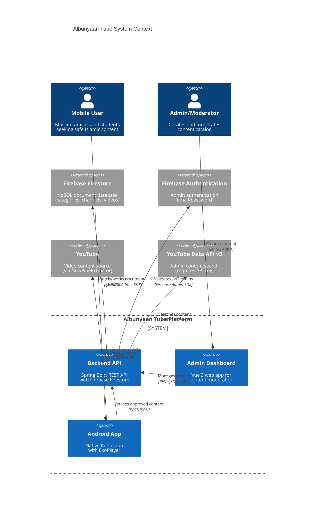

# C4 Level 1 — System Context Diagram

This diagram shows the high-level system context for Albunyaan Tube, illustrating the relationships between users, the platform components, and external systems.

## Key Relationships

### Mobile Users ↔ Android App
- **Users**: Muslim families, students of knowledge
- **Actions**: Browse categories, watch videos, download offline, search content
- **Protocol**: HTTPS (production), no authentication required

### Admin/Moderators ↔ Admin Dashboard
- **Users**: Platform administrators and content moderators
- **Actions**: Search YouTube, approve/reject content, assign categories, manage users
- **Protocol**: HTTPS with Firebase JWT authentication
- **Roles**:
  - **ADMIN**: Full permissions (approve, manage users, delete content)
  - **MODERATOR**: Submit for review only (no direct approval)

### Android App ↔ Backend API
- **Endpoint**: `/api/v1/content` (public API)
- **Purpose**: Fetch approved channels, playlists, videos with category filters
- **Response**: JSON payloads with YouTube IDs (no metadata, resolved client-side)
- **Authentication**: None (public access)

### Admin Dashboard ↔ Backend API
- **Endpoints**: `/api/admin/*` (protected endpoints)
- **Purpose**: Content search, approval workflow, category management, audit logs
- **Authentication**: Firebase JWT in `Authorization: Bearer <token>` header
- **RBAC**: Custom claims (`role: ADMIN|MODERATOR`) validated via Spring Security

### Backend ↔ Firebase Firestore
- **Collections**: categories, channels, playlists, videos, users, audit_logs, validation_runs
- **SDK**: Firebase Admin SDK (Java)
- **Operations**: CRUD operations, queries with filters/pagination

### Backend ↔ Firebase Authentication
- **Purpose**: Validate JWT tokens on every admin API request
- **Custom Claims**: `role: ADMIN|MODERATOR` checked by Spring Security
- **SDK**: Firebase Admin SDK

### Backend ↔ YouTube Data API v3
- **Purpose**: Admin content search (channels, playlists, videos)
- **Authentication**: API key in `YOUTUBE_API_KEY` environment variable
- **Caching**: Results cached in Caffeine (dev) or Redis (prod optional) with 5-minute TTL
- **Note**: Only used in admin dashboard, never in mobile app

### Android App ↔ YouTube (via NewPipeExtractor)
- **Purpose**: Resolve video stream URLs without official YouTube API
- **Library**: NewPipeExtractor (https://github.com/TeamNewPipe/NewPipeExtractor)
- **Privacy**: No official YouTube API = no tracking, no Google account linking
- **Note**: Stream URLs extracted on-device, not via backend

## Excluded from Diagram (Out of Scope)

- **Firebase Cloud Messaging**: Not in MVP (push notifications deferred to v1.1+)
- **Redis Cache**: Optional production cache (commented out in application.yml)
- **CDN**: Thumbnail caching deferred to v1.1+
- **Secrets Manager**: AWS/GCP Secrets Manager deferred to v1.1+

## Security Boundaries

### Public Access (No Authentication)
- Mobile users → Android app → Backend public API (`/api/v1/*`)
- Android app → YouTube (NewPipeExtractor)

### Authenticated Access (Firebase JWT)
- Admin/Moderators → Admin dashboard → Backend admin API (`/api/admin/*`)
- Backend → Firebase Authentication (token validation)
- Backend → Firestore (authenticated SDK calls)

### Secrets (Environment Variables)
- `YOUTUBE_API_KEY`: Backend → YouTube Data API v3
- `FIREBASE_SERVICE_ACCOUNT_PATH`: Backend → Firebase Admin SDK
- `DOWNLOAD_TOKEN_SECRET_KEY`: Backend download token generation

---

**Related Diagrams**:
- [backend-components.md](backend-components.md) - Backend internal components (Level 3)

**Last Updated**: November 10, 2025
