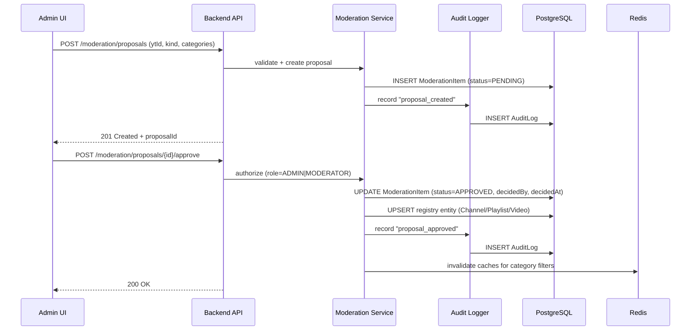

# Moderation Proposal Sequence

```mermaid
sequenceDiagram
    participant Admin as Admin UI
    participant API as Backend API
    participant ModSvc as Moderation Service
    participant Audit as Audit Logger
    participant DB as PostgreSQL

    Admin->>API: POST /moderation/proposals (ytId, kind, categories)
    API->>ModSvc: validate + create proposal
    ModSvc->>DB: INSERT ModerationItem (status=PENDING)
    ModSvc->>Audit: record "proposal_created"
    Audit->>DB: INSERT AuditLog
    API-->>Admin: 201 Created + proposalId

    Admin->>API: POST /moderation/proposals/{id}/approve
    API->>ModSvc: authorize (role=ADMIN|MODERATOR)
    ModSvc->>DB: UPDATE ModerationItem (status=APPROVED, decidedBy, decidedAt)
    ModSvc->>DB: UPSERT registry entity (Channel/Playlist/Video)
    ModSvc->>Audit: record "proposal_approved"
    Audit->>DB: INSERT AuditLog
    ModSvc->>Redis: invalidate caches for category filters
    API-->>Admin: 200 OK
```
